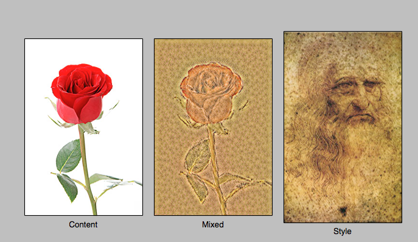
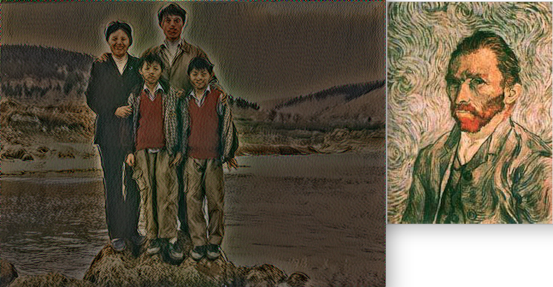

RosePrisma
=========================
### Introduction
> 使用深度学习算法将玫瑰花图片内容和另一幅图片的风格融合在一起。

### Requirements
```
1. python        ----- 开发语言
2. vgg16         ----- cnn model
2. TensorFlow    ----- 深度学习工具包
```
### Using
> 1) git clone project
>    git clone https://github.com/zjucx/RosePrisma.git
> 2) download [vgg16.tfmodel]( https://s3.amazonaws.com/cadl/models/vgg16.tfmodel) to dir model
>    cd RosePrisma && mkdir model
> 3) modify content and style image
>    vi maim.py && change your pic

### demo




### Reference
- [An Intuitive Explanation of Convolutional Neural Networks](http://andrew.gibiansky.com/blog/machine-learning/convolutional-neural-networks/)
- 翻译版：[翻译 神经网络的直观解释](http://www.hackcv.com/index.php/archives/104/?hmsr=toutiao.io&utm_medium=toutiao.io&utm_source=toutiao.io)
- [A Neural Algorithm of Artistic Style](https://arxiv.org/pdf/1508.06576.pdf) Style Transfer Algorithm
- [TensorFlow Tutorial](https://github.com/recheer/TensorFlow-Tutorials) powder by Hvass-Labs. [youtube](https://www.youtube.com/playlist?list=PL9Hr9sNUjfsmEu1ZniY0XpHSzl5uihcXZ)